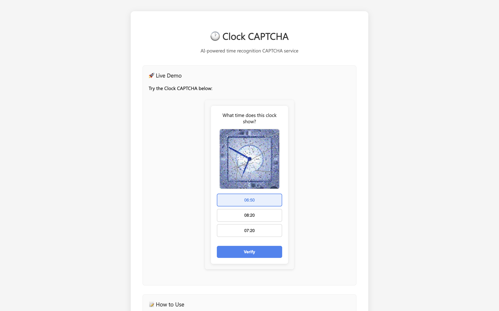

<!-- # ClockCAPTCHA

Based on: [https://huggingface.co/spaces/AP123/IllusionDiffusion](https://huggingface.co/spaces/AP123/IllusionDiffusion) -->


# ClockCAPTCHA

<div>
  
</div>


<div align="center">
  <h3>🤖 AI-Generated Clock CAPTCHA Service</h3>
  <p><em>A clock image-based CAPTCHA service in the style of Google reCAPTCHA</em></p>
</div>

<div align="center">
  
  
  
  
</div>

---


## 🚀 Install and Start 

### 1. Install repo

```bash
git clone https://github.com/yourusername/ClockCAPTCHA.git
cd ClockCAPTCHA
pip install -e .
```

### 2. env setting

```bash
cp .env.example .env
nano .env
```

### 3. server run

```bash
python main.py
```
The server runs at `http://localhost:8000`! 🎉

## 💻 Example

### Web

```html
<!DOCTYPE html>
<html>
<head>
    <title>My Website</title>
</head>
<body>
    <form id="myForm">
        <input name="email" placeholder="이메일" required>
        
        <!-- ClockCAPTCHA widget -->
        <script src="http://localhost:8000/api.js" async defer></script>
        <div class="clock-captcha" data-sitekey="demo"></div>
        
        <button type="submit">sumbit</button>
    </form>
</body>
</html>
```

### Backend

```python
import requests

def verify_captcha(token):
    response = requests.post('http://localhost:8000/api/siteverify', {
        'token': token
    })
    return response.json().get('success', False)

if verify_captcha(user_token):
  # CAPTCHA passed - perform the actual task
  save_user_data()
else:
  # CAPTCHA failed - handle the error
  return "CAPTCHA verification failed"
```


## 🔧 API endpoints

| endpoint | method | description |
|-----------|--------|------|
| `/demo` | GET | demo page |
| `/api.js` | GET | JavaScript client library |
| `/widget` | GET | CAPTCHA widget iframe |
| `/api/challenge` | GET | new CAPTCHA challenge generation |
| `/api/verify` | POST | user answer verify |
| `/api/siteverify` | POST | server token verify |

## ⚙️ env

```env
# Security Settings
JWT_SECRET_KEY=your-secret-key-change-this-in-production
JWT_ALGORITHM=HS256
CAPTCHA_EXPIRY_MINUTES=5

# Server Settings
HOST=0.0.0.0
PORT=8000
CORS_ORIGINS=*
CORS_CREDENTIALS=true

# AI Settings
GENERATED_IMAGES_DIR=generated_captchas
NOISE_INTENSITY=0.6
OUTPUT_SIZE_WIDTH=256
OUTPUT_SIZE_HEIGHT=256
GRAYSCALE=false
```


## Based on

- **IllusionDiffusion**: [https://huggingface.co/spaces/AP123/IllusionDiffusion](https://huggingface.co/spaces/AP123/IllusionDiffusion)


## Licence

`MIT License`